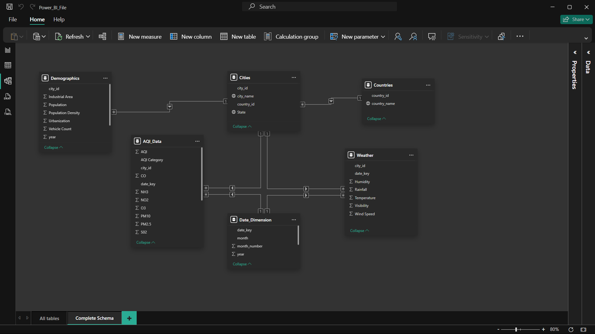
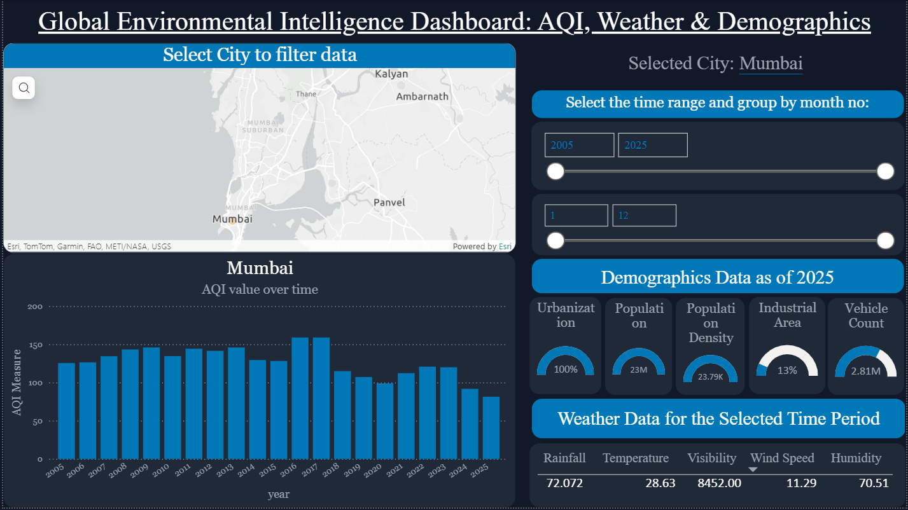
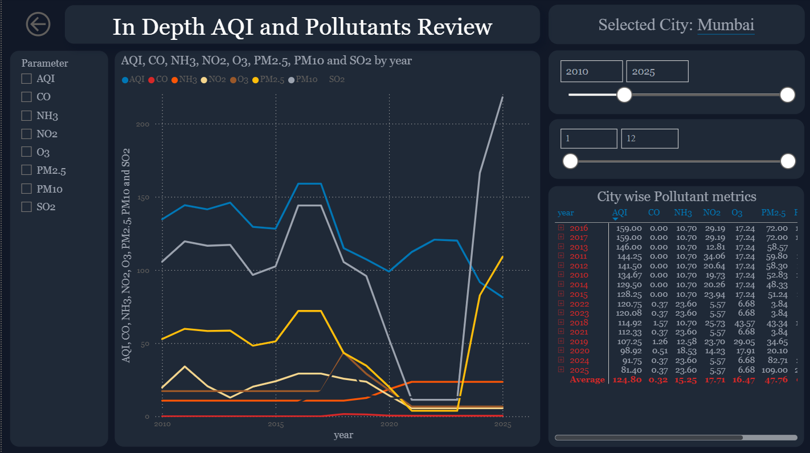
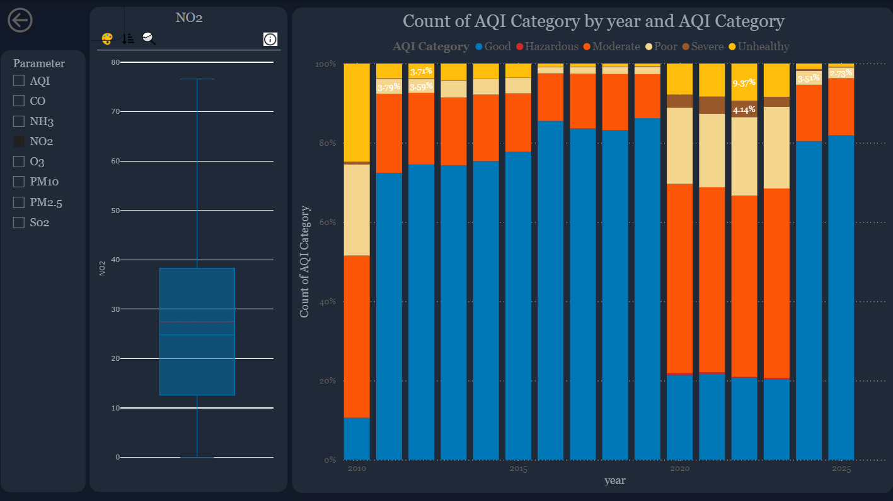
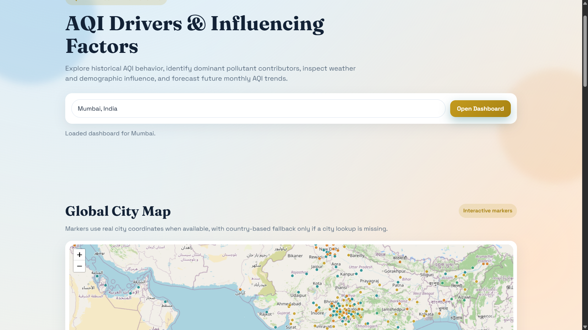
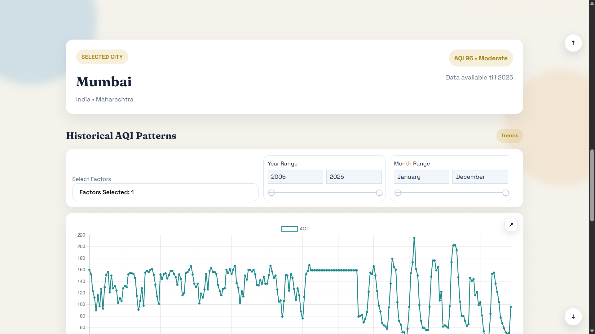
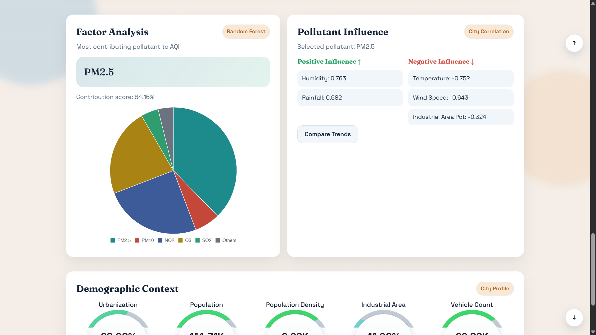
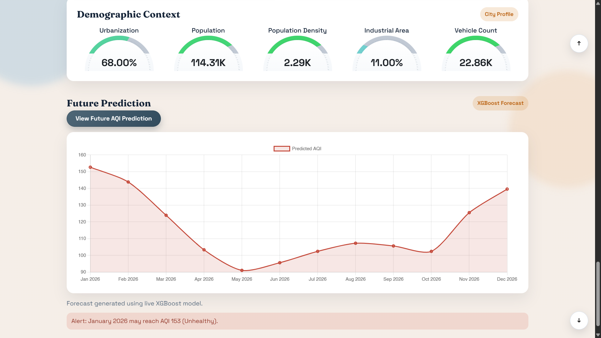

# AQI Analytics and Forecasting Platform

An end-to-end Air Quality Index (AQI) analysis and forecasting platform. This project integrates a comprehensive Power BI analysis, a robust Flask backend, a dynamic vanilla JavaScript frontend dashboard, and machine learning pipelines. The entire project was developed iteratively in phases, focusing on accurate data representation and predictive analytics.

## 🧹 Phase 1: Dataset Cleaning & Preparation

The foundational dataset comprises historical AQI, weather, demographics, and date-dimension data. To ensure data integrity, some synthetic data was strategically incorporated to fill gaps and maintain consistent coverage. 

The data cleaning pipeline was executed in the following steps:
1. **Negative Value Removal**: Extraneous negative (`-ve`) values were identified and eliminated.
2. **Precision Rounding**: Relevant numerical columns were rounded to two decimal places for consistency.
3. **Data Thresholding**: Cities with less than 5 years (60 months) of historical data were removed to maintain statistical significance.
4. **Date Dimension Creation**: A dedicated Date Dimension was generated to support robust time-series analysis.
5. **Entity Cascading**: Cities that failed to meet the threshold were removed from the main table, and these deletions were strictly cascaded to all associated relational tables.
6. **Country Updates**: Similarly, country references were updated and synchronized across the entire schema.

### Data Schema  
The underlying architecture utilizes a star/snowflake schema linking AQI data, cities, countries, demographics, weather, and a date dimension.


---

## 📊 Phase 2: Power BI Dashboard Analysis

Following the data cleaning, an initial analysis was conducted using Power BI to establish a strong analytical baseline. This phase explored historical trends, pollutant distributions, and geographical comparisons. 

*Note: Each Power BI dashboard view is equipped with advanced drill-through features, enabling deep dives into specific cities, years, and pollutant metrics.*

### Global Environmental Intelligence
An overarching view of AQI, weather, and demographic contexts.


### In-Depth AQI and Pollutants Review
Detailed breakdown of individual pollutant metrics (AQI, CO, NH3, NO2, O3, PM2.5, PM10, SO2) over time.


### AQI Category Distributions
Analysis of AQI category counts (Good, Moderate, Unhealthy, etc.) and pollutant distribution outliers.


---

## 🧠 Phase 3: Machine Learning & Modeling

The project leverages three core modeling approaches to derive insights and forecast future trends. The resulting model artifacts are serialized and saved using `joblib` (as `.pkl` files) for efficient instantiation in the production backend.

1. **Random Forest Regressor**
   - **Purpose**: Feature importance extraction.
   - **Details**: Analyzes historical data to determine the most significant pollutants driving the overall AQI.
   
2. **XGBoost (Extreme Gradient Boosting)**
   - **Purpose**: Time-series AQI forecasting.
   - **Details**: Predicts future monthly AQI values by evaluating historical lags, weather conditions, and demographic features.

3. **Statistical Correlation Model**
   - **Purpose**: Pollutant influence mapping.
   - **Details**: Computes city-level correlation matrices to map the relationships between different environmental factors (e.g., how humidity correlates with PM2.5).

---

## 🌐 Phase 4: Web Application & Dashboard Features

Following the data preparation, Power BI analysis, and machine learning modeling, a dedicated web platform was developed to serve the insights interactively.

### Global City Map
Users can explore historical AQI behavior and identify dominant pollutant contributors across different cities on an interactive global map.


### Historical AQI Patterns
The dashboard allows users to select a specific city and visualize historical AQI trends over custom date ranges.


### Factor Analysis & Pollutant Influence
Identify the highest contributing pollutants to the AQI and observe how environmental factors influence pollutant levels.


### Future Prediction & Demographics
View the demographic context for each city (urbanization, population, industrial area) alongside XGBoost-powered future monthly AQI forecasts.


---

## 📁 Repository Structure

```text
BDA_CP/
├── README.md
├── requirements.txt
├── artifacts/                  # Generated JSON/CSV outputs (correlations, feature importance)
├── backend/                    # Flask API source code
├── data/                       # Cleaned datasets
├── frontend/                   # Vanilla JS/HTML/CSS dashboard
├── models/                     # joblib (.pkl) model artifacts
├── notebooks/                  # ML training and correlation notebooks
├── Screenshots/                # Dashboard visualizations
└── Power_BI_dashboard.pbix     # Original Power BI dashboard file
```
*Note: `env/`, `.git/`, and `__pycache__/` are local workspace/runtime folders and are not part of the documented project source tree.*

---

## 🚀 Setup and Installation

1. **Install Dependencies**
   ```bash
   pip install -r requirements.txt
   ```

2. **Generate Models (Optional)**
   Run the notebooks in `notebooks/` sequentially to retrain the models and refresh the generated outputs in `artifacts/` and `models/`.

3. **Start the Backend Server**
   ```bash
   python backend/app.py
   ```

4. **Launch the Application**
   Open the application in your browser at `http://127.0.0.1:5000/`.

---

## 📡 API Reference

The Flask backend exposes several endpoints for data retrieval and prediction:

```bash
# Retrieve city-specific AQI data
curl "http://127.0.0.1:5000/get_city_data?city_name=Delhi"

# Retrieve global feature importance scores
curl "http://127.0.0.1:5000/get_feature_importance"

# Retrieve pollutant correlations for a city
curl "http://127.0.0.1:5000/get_pollutant_correlation?city_name=Delhi"

# Generate future AQI predictions using the XGBoost model
curl "http://127.0.0.1:5000/predict_aqi?city_name=Delhi&horizon=12"
```

---

## 📝 Data Notes
- **Coordinates**: The dataset does not include latitude and longitude; the map utilizes deterministic estimated coordinates for city placement.
- **Synthetics**: Some demographic and weather values are synthetic, used to ensure uninterrupted coverage across the timeline.
- **Error Handling**: If `joblib` model files or artifact files are missing from the `models/` or `artifacts/` directories, the backend API will return a descriptive error indicating which notebook must be run first.
